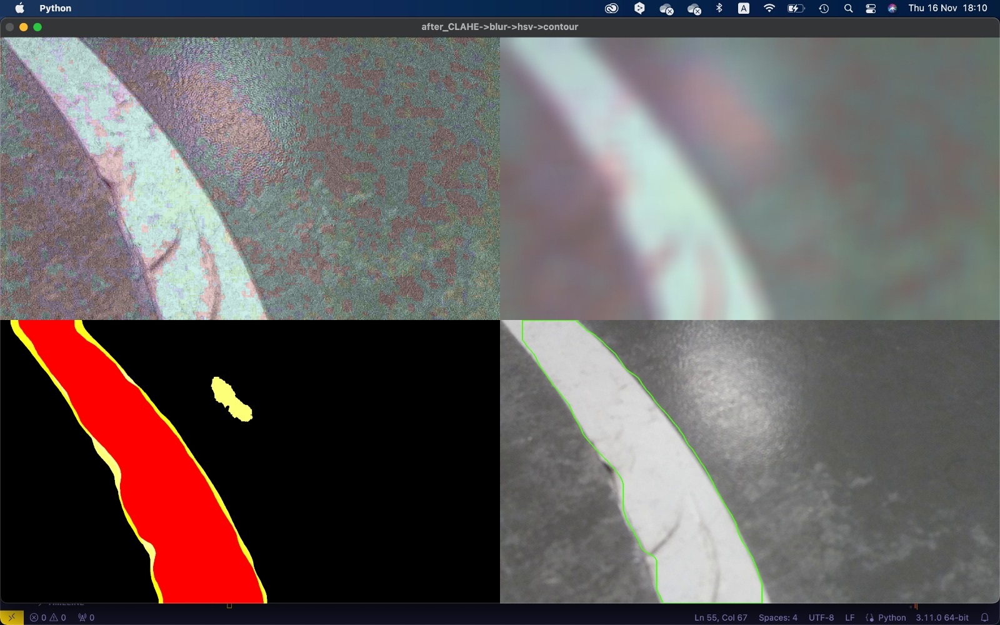
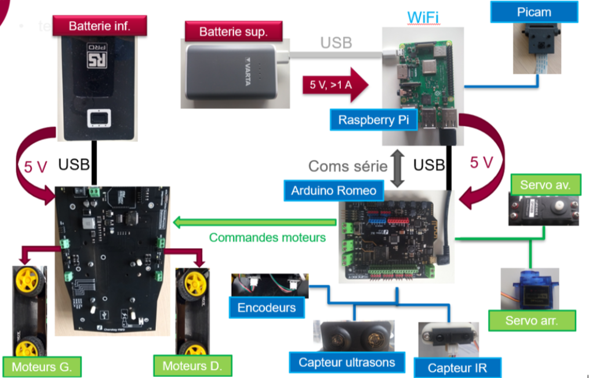

# Autonomous Delivery Robot

## Project Description

This project involves developing and testing functionalities for an autonomous delivery robot designed for urban "last-mile" delivery. The robot features a high degree of autonomy and communicates wirelessly with a central system to exchange information and receive instructions for coordination.




### Key Objectives and Challenges

1. **Obstacle Management**
    - **Detect obstacles on the path**
    - **Avoid obstacles**
    - **Detect moving objects (e.g., other robots)**
    - **Plan a trajectory around obstacles**

2. **Line Following**
    - **Ensure the line is centered in the camera**
    - **Correct the trajectory in real-time**
    - **Robustness to varying illumination conditions**
    - **Control the robot's path**

3. **Control**
    - **Longitudinal control**
    - **Lateral control**

4. **Hardware/Software Integration**
    - **Integrate Arduino and Raspberry Pi boards**
    - **Computer vision with limited hardware computing power**
    - **Real-time sensor integration and synchronization**

5. **Efficiency**
    - **Energy efficiency**
    - **Adequate speed for timely delivery**

6. **Localization**
    - **Know the robot's position in the environment**
    - **Navigate to a destination point**

### Hardware Architecture

- **Arduino Romeo**
- **Raspberry Pi 3 B+ (with integrated WiFi)**
- **Camera on a tiltable mount**
- **Ultrasonic and infrared sensors**
- **Servomotors at the front and rear**
- **Li-Ion battery or Ni-MH accumulators for motor power**




### Project Structure

- `src/` - Source code
  - `Control/` - Control algorithms
  - `Decission/` - Decision-making modules
  - `Perception/` - Perception and sensor processing
  - `robust_serial/` - Serial communication utilities
  - `arduino/` - Arduino sketches
- `tests/` - Test scripts
- `.env.example` - Example environment variables
- `.gitignore` - Git ignore file
- `setup.py` - Setup script for installing the package
- `README.md` - Project documentation

### Installation

1. Clone the repository:
    ```bash
    git clone https://github.com/yourusername/autonomous_delivery_robot.git
    cd autonomous_delivery_robot
    ```

2. Create and activate a virtual environment:
    ```bash
    python -m venv venv
    source venv/bin/activate  # On Windows, use `venv\Scripts\activate`
    ```

3. Install the package:
    ```bash
    pip install -e .
    ```

### Usage

Run the main script:
```bash
python -m src.main
